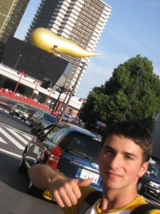

# リズム

*Originally posted 2009-09-14 at <https://inpixels09.wordpress.com/2009/09/14/%e3%83%aa%e3%82%b6%e3%83%a0/>*

  

My host sister, Misaki, went to see a college in tokyo yesterday, and, since it was tokyo, i bit the bullet and tagged along. i knew ahead of time there would be no time for fun and games, as it was a college visit, but even from the seat of a bus, tokyo in all of its technocolor brilliance is worth 3 hours. the buildings look like superman ice cream some times. id like to live there at some point in my life. And so, i spent a total of maybe 2 hours outside of the college building- here and there, i noticed some things.

ive gotten semi-familiar with the rythms of japan:  

japanese is all about the timing and rythm of conversation. every syllable, in itself, consists of either a vowel or a consonant followed by a vowel (or the just the letter n)- there are a limited number of syllables, somewhere under 70. 

thus, easier for robots. pretty damn convenient.

but also, two people talking will carry their own time. its a quick back and forth, with each party frequently confirming what the other party has to say. for instance:

miyuki: its cold today  

mizuki: yes, today is cold, isnt it?

jay: im rather fond of tempura  

haruka: oh, do you like tempura?

and, when i was first getting acquainted to the language, i was like  

jay: yeah, of course. i just said that.  

but its not like that. its back and forth.  

in the streets, or in a mall, you can walk by a store and hear smartly dressed showgirls speak out into space, at no one in particular about their product. i try to make eye contact, but its not as if they are talking to me, even if i catch her eyes. she just kept on talking like she was working with her hands, looking up for a break from the showcase. she was selling these little banana-shaped pastries filled with cream; My cousin living in tokyo gave me and my family some last time i was here, in japan.

when asking questions to get aquainted in japan, there are about four, and by now i know what to expect. were i an artist, i would liken it to a dance and say each person has a role to play, but that would be lame and i get enough ridiculous drama from dagny taggart… and japanese tv dramas…  

what are your hobbies?  

apparently japanese sleep a lot on the weekend, or at least the majority of class 1-13 seems to think thats how they spend their days off.  

what do you want to be when you grow up?  

most people are tracked already by highschool, as you take tests and choose quazi-majors. speak to an guy, you say business. when you speak to a girl, or a mother (this is a killer move, btw) you pause a second, looking off, and say you look forward to being a father.  

when i want to be honest, i say im not sure. but that breaks rythm.

in tokyo, my host mother, sister and i, after a day of college visits, found a small udon shop and ate a bowl apiece. i saw a small, quaint shop like a hole in the wall where a woman in a kimono sat with her hands in her lap. i bought a banzai headband, for intimidation, and a ‘daruma,’ a doll made of paper mache whos eyes you fill in as you realize your wish. (something you work towards, something possibe) we got home and now here it is, sitting on my desk, neither eye painted. im not sure what my wish is, yet. misaki decided to enter the english language school, for the next two years, and i congradulated her for it. she’s gonna do great.

…

i still havent found any pokemon.
