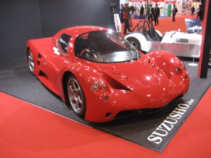
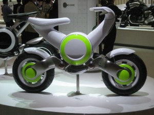
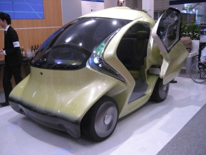
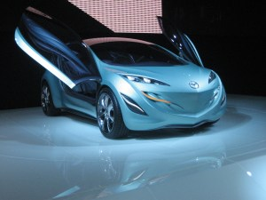

# 東京, once again

*Originally posted 2009-10-24 at <https://inpixels09.wordpress.com/2009/10/24/%e6%9d%b1%e4%ba%ac-once-again/>*

  

A little over a week ago, my dad sent me an email saying that a friend of ours was coming to Tokyo to cover the annual motor show there, and that he had asked if i could come. This guy’s a real neighborhood pal, one of Dad’s biking buddy’s and a total motor-head. My dad and i frequently make major detours on our way, to wherever, to see what hes breaking and building in his garage, that night. I was able to set it up such that i skipped half the week of school, to take a trip to Tokyo and see the motor show, and he was generous enough to let me crash in his hotel room. last tuesday morning, i rode the train in. 

he had come over with nissan. ‘with nissan?’  i didnt get it either, but it seems like large car companies bring reporters and journailists over to large events like this, where they are revealing a new car or system, etc., pack their schedules with informational sessions, and hope to get a good write-up. as we walked around the show, all of the hundreds of journalists we met exchanged the question, ‘who are you here with?’  

  

the nissan group, who we followed for a good portion on the time, was pretty entertaining. there were these curmudgeonly old men who complained about the lack of trash cans (there really arent many trash cans), some younger, more energetic writers from around the country and then quite a few writers from latin america. At a dinner party they provided one night, way at the top of the well-kept hotel we stayed in, i talked with a friend of my hosts from mexico and looked down on the lights of the city. he told me the less expensive a car was, the safer he felt driving it, in mexico. in Tokyo, there are a pair of white-gloved policemen on nearly every corner.

I got to Tokyo early tuesday morning, after the 3 hour train ride. and, no joke, for the last 40 minutes it was all city, all Tokyo. I dropped my bags at the hotel, while my host was at a meeting, and left to walk around tokyo for the day. i made my way around quite a few districts, mostly taking back streets, had lunch in a small noodle shop outside of roppongi, then took the subway to shinjuku, one of the largest stations in the world.

after walking around alone for the entire day, I was tired and skipped the massive electronic stores for the cafes, finally finding myself on a backstreet, slowly getting darker. the neon signs were lighting up, and it was getting a bit chilly out. I was dealing with a vending machine, when i heard a voice behind me and turned, then looked down; a ‘stout’ little woman was fumbling with her words and asking me if i spoke japanese. i was curious, and having been to myself all day, i decided to talk to her. she told me about a church, in the outer districts of Tokyo and how the lord had sent her to spread the word to me, and i listened and decided i had better follow this stout woman because it sounded interesting and i had another 3 hours to kill, at the time. she took me to the station, gave me a ticket and we took a 20 minute train to somewhere that doesnt exist on the metro maps. we talked all the way about me, her, the church, japan and a pool of other things. but yeah, i, too, was silently wondering what type of kidnap it was at this time. 

pretty tight, actually. it was a teeny little building snuck in between two short apartment buildings, on top of a hill in mild city climate. we went in, and were immediately greeted by 3 well-dressed hosts, given tea and a bible, and a fourth came to sit with us. we ended up talking about stories from the bible and what they ment to us, the three of us, for about an hour; i actually read steinbeck’s ‘east of eden’ just before i left, so had the story of abraham, translation and interpretation of the words of the bible to lean on… which actually fit the conversation perfectly. we finished up the talk with a session of blabbering, talking in nonsense. i didnt really get it, but apparently you say ‘halleluiah’ many times, very fast, and new words come down to you.  

And now i realized i was yelling nonsense with two others in a church in the outskirts of Tokyo… and had to restrain myself from laughing, to myself, while chanting. they entered me into their books, and now i can go visit their branch in new york, if i want.  

 the woman, a real smiley and perky japanese housewife, took me back to the station and gave me a subway ticket to the hotel, molestation free. she wrote down her number and mail address, i gave her mine, she smiled up at me and then she wished me a good journey. i have been texting with her, a little, since then, and im glad to say that she very sincerely cares.

When i knocked on the door of the hotel room, I heard an excited english voice saying ‘come on in!’, and spent the evening catching up with my host and friend, in english and between french restaurants and dimmed, warm lights. 

theres a lot more to Tokyo, and later, ill tell you all about it.  

  

