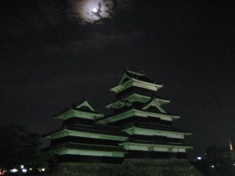

# Thoughts of the Night

*Originally posted 2009-11-01 at <https://inpixels09.wordpress.com/2009/11/01/thoughts-of-the-night/>*

This morning, the weather was fall’s calm clear and i could see the mountains in the distance. tonight, clouds are overhead and i can almost hear the rain if i listen, closely.  

I am sitting in my room cross legged and back straight on the mattress, bottom bunk such that there is a roof over my head, but I am elevated from the floor. light from my laptop’s notepad is showing me my hands, since i don’t have the light on. sometimes, after a day in the presence of the family, i come here;  this is my rare normal, a state of peace- not tranquility, like sitting quiet with the warm vibrations of game shows reminding you they are there- but peace, when my thoughts finally speak in english, speak clearly, and when they speak directly to me. these are the things that i am thinking, as of now- these are my thoughts of the night.

My host mother was in a car accident yesterday morning. streets that cut between rice paddies are thin and few, so you pull over when another car drives towards you and take it slow when theres one behind. She was driving straight, stopped at a sign and saw in the rear view mirror that the car behind wasnt slowing down. it was a back end collision, where she was bracing for the shock, in her large toyota van, and the k-class (extremely small cars that, according to my friend from the motor show, only exist japan) pickup truck behind her had the airbag inflate. She was fine, only surprised and spoke quickly like if she stopped, she might forget- the kid in the k-class behind her, however, took a blow.  

she told me that the kid went into “dogeza.” it sounds like “together,” so i thought it was a bit funny at first, because it was like saying they did it “together.” i asked what it meant; the kid had stumbled out of the car, sat on his knees and calfs, on the pavement, and crunched over while bowing, repeatedly. he had touched his forhead to the ground in apology, repeatedly. this is “dogeza.” my mother thought it was a little embarassing, but respectful. like always, i sank back and looked at the faces of my family at the table, and thought. the image is still sticks my mind of a kid bent over on the pavement in the morning, who looks up quickly, painfully, squinted eyes and upturned eyebrows, then rips his glance down and continues rocking back and forth. and when i see it, it’s from my mothers point of view. 

I have a folder in the bottom shelf of my desk, across the room, where i keep pieces of paper i want to save. theres a few photos and quite a few letters, but i saw a bright slip the other day when looking myself over again, at a time like this, and pulled it out. it said “let’s protect our important lives” in impact font, then listed a number in red letters. Its a suicide hotline. when I step off the train in the morning, there are usually people waiting with bags full of tissue packs, advertisements printed on the front- i think i picked this one up a few weeks after i got here, and thought it was a valid insight into what goes on.  

I talked about cancer with some friends after class, continuing from smoking, then asked about HIV/AIDS. I hadnt heard too much about it since coming here; it seems so clean and we relate disease with grime, plus people dont readily open up to someone who cant pronounce their word for “Cooking” correctly, as i found out. And its true, there arent many lives lost to STDs or cancer, not when you compare; when i asked about death, they took it to mean suicide. they talked about suicide and when it touches their lives.  

they thought it was one of the leading causes of death among kids their age, such that its not a foreign word to even young kids. highschool kids lose their way sometimes when they feel they have no hope and pain is what prevails too many times, was what they all seemed to come to.  

 there are times when i cringe and think that something is wrong in every sense, not believable and something i cant comprehend. you can distance yourself from these things, they dont exist as solid bits of life, i sometimes thing. i thought about the time on the elementary school bus when Tim Van Riper told me that humans were animals, and i wouldnt believe him.  

when i finger a leaflet distributed at a train station to random people, as an outcry to stop it all, thats when i believe it. i cringe.  

if someone has no fear of death, is it right to scare them? if someone tells you they have nothing to live for, is it right to ask them to stay? i think the answer, is in how you think the earth looks, your perspective and where it has and hasnt been, what things youve found and what hope they give you, what you expect the world is coming to after walking around and listening at the places you have been. 

yes, i think i have found some perspective.

last night i came out of the shower and stumbled to the sink. i had water beaded on my skin, was red and breathing deeply. i leaned forwards on my arms, supported by the two corners of the sink and looked forward into the mirror, squinting my eyes.  when i compare mysdelf to the boys in japan who walk around with perfectly disheveled hair and pre-wrinkled jeans, i think i cant compete. i tried messing up my hair with wax before school, a few times, and thought it was only mild. ‘your an ugly bastard, jay,’ i thought, like it was reckless, ‘but you look mysterious. thats an asset.’ people cant know what im thinking, ive concluded, no matter how clear i describe things. hell, ive been at it for almost 17 years. can people feel for me? can i know what they are thinking?

since the end of the summer, i have been living here, in this house, and commuting every day. i spent the weekend at my area representative’s house in nagano city, sightseeing during the day, and at night, we spoke. this week, i will be changing host families. my representative agreed, and i came home this morning with him, sat down around the low table in the living room, and spoke with my mother. my two siblings, when she asked them to leave the room, seemed annoyed but had some idea of what was coming. we spoke calmly, in there, for almost half an hour. she agreed that if it was what i wanted, and what i thought was best, then it could be done. i think she has been watching me lately, and has the idea of how i feel. i think she gets it that its a large, large maze, dark and often silent, that ive gotten in.  

she was sad, clearly, and i was too, but only she cried, and only slightly, with gently puffed red eyes.  

my little brother turned 13, and i called my parents to send some english spiderman comics and put it on his bed earlier today. i spoke to him for a while on the night of his birthday about 13, while he sat on the top bunk and i leaned on the rail. we ate american halloween candy, also from my family, two or three nights ago as i explained the widepsread influence of wax lips on childrens halloween attire. the wax lips didnt get eaten, though. I think about how id like to leave it with my family, and i think these final things will make it the softest.  

after my area rep left, there was tranquility, peace, in the room. it was a soft way to bring things to a close, after a difficult while. maybe she saw it on my face. my mother and i sat on our knees and calfs on the floor, in silence. i looked at her and told her i still wanted to be in contact, still wanted to see her every now and then, i would be here for a while; i still love her, i love them all, but things didnt quite work out. we exchanged apologies, and her eyes closed a bit and she solemnly, quietly tucked her lips inward. 

i told her that jinsei, our lives, are long, and her glance floated slowly down from my eyes, like a fall leaf that might float down and come to rest at your feet.

---

## Comments (2)

**D** — 2009-11-11

> What’s the difference between Kitamatsumoto, Matsumoto and Nishimatsumoto??

**Jay** — 2009-11-11

> kita = north, nishi = west, minami = south and higashi = west- its just the districts. cities here are so spread out (takes up the entire valley!) that they have to section them out into smaller, ann arbor-sized districts. im right in the middle, straight up matsumoto.

