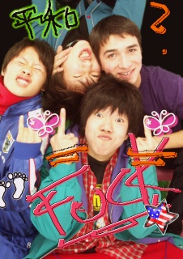

# ‘Left’ Days

*Originally posted 2009-12-01 at <https://inpixels09.wordpress.com/2009/12/01/left-days/>*

I put my hand in the upper front pocket of my blue bag late tonight. its a beaten blue backpack ive had since middle  school, but is still stitched together. i reached into a dense sack of sloppily folded papers, some grimier than others, all with pencil lines lightened by sweat from my hands. i sat back and thought damn, i have to clean this. i have to get rid of these things.

Whenever i hear a new word, or realize a new arrangement of the chinese characters that make up the written language, i write it down to “memorize later.” when i get things made of paper, its sunken into a reflex for me to crunch over and obsessively cover it in characters, diagrams, etc- handouts, receipts, envelopes, my math notes, like they might have been pushed twice through the printer. i am studying Kanji, the chinese characters that are the basis for the written language. 

A small group of people came to see my drawings, today on the inside cover of my ‘science’ notes; i avoid definition of new words and their characters in english, and so will draw stick figure scenes to illustrate the idea- recalling the word is more direct, or fluid, this way. we write smaller and more fine for the complex, sharp and compacted shapes and lines of these characters than english letters, a skill i am training my fingers, arm and upper back for. i have a thing for broken tips on .5 lead because they write with a sharper point. i break it off when my characters get sloppy. a kid in class is teaching me to twirl the pencil between my fingers.

This is how my days go by in the classroom, while the teacher is talking and when everyone else is reading and working. all was well until i found myself an outlet to cling to a week or two back, and havent parted with it since- the books of Haruki Murakami. ever heard of ‘a wild sheep chase’? a surreal, unusual adventure of a slow and incredibly uninformed narrator to hokkaido to capture and retreive a sheep with mystical powers, making detours, getting lost on the way and smoking and drinking as he waddles along. ive read it in english before, which was great, but i love what i can get out of the japanese version. 

things certainly make more sense in the original language; these are the authors original words, not another’s interpretation. it wasnt clear before, but what becomes obvious is that the main character, who we think is a brutally honest, exceptional loser when stated in english, is actually a brutally normal japanese 30-some year old. said in japanese expressions in a much more japanese context, his character becomes an instance of a much more common set of people you get used to around here. i see so many faces that would fit to this guy, walking the streets. i say ‘this guy,’ because Murakami doesnt give him a name.

I certainly find things to think about in my foreign reading. when i compare it with my memories, its a good excercise in methods of translation. i talked with my brother on the phone about it. he asked me, “is that the one with ‘the Rat?'” “the Rat? you mean his friend ‘Mouse?'” – same in japanese. Its interesting in the variations of chinese character representations of words: some, archaisms and meant to be so to give an effect, others not even official readings but after-the-fact synthesized combinations chosen because they form the correct pronunciation, and may loosely represent the actual meaning, but bring out some other connotation in the word. (ex: Murakami’s spelling of “tobacco,” a foreign word, is composed of ‘smoke’ and ‘grass/plain.’ certainly more open to interpretation than just the word, or its pronunciation. i think of reeds in the wind in a wide flat plain, when i see that second character. when our hero smokes three cigarettes in a bar looking out on the city, it seems desolate and he seems displaced from his surroundings.)

There was a relatively recent movie of romeo and juliet starring Leo Dicaprio, forget the girl and forget the director but i think he was italian. there were neon lights, guns, beaches and hair gel, but it always rested on these spaced-out slow guitar riffs. i saw it in a unit on shakespeare in my 10th grade english class, looked up the soundtrack on itunes and now listen to it when i read, when i get the chance. they fit perfectly.

I was reading at home, and Naohiro told me hed like to read the book once i was finished, so we could talk about it. he seemed interested. 

my mother sings vocals in a jazz band thats been going for 30 some years. i told her i was interested, and she invited me to their next practice that week, on the condition that i would correct her pronunciation for the first few tracks on chick corea/return to forever’s ‘light as a feather.’ she sang it beautifully. in a crazy connection, a recent irish exchange student who apparently has been going to a school near mine also guest starred at the practice and played a traditional irish flute for us all. (i brought my ukulele but chose not to take it out, because these guys were clearly about playing music, not screwing around.) he seemed like a nice kid, so we exchanged contact info after a quick conversation and i told him id love to hang out.  

yesterday i got a text message from him, asking what i had in mind, and so today i met him after school and we went for coffee. hes a tall, buzz-cat (cutted?) 19 year old already out of highschool and here for a semester, knew some dirty japanese and had things to say. i got his opinion without even having to pry for it, on so many things and we talked for 4 hours until the first cafe closed and the next one started locking doors, steadily, one by one. 

We talked about impressions on japan, japanese food, japanese females, our own countries (and their respective females), and finally i stopped asking questions to structure myself while we spoke louder and faster in a mix of the two languages. i described to him my summer and how i liked my ‘bouken,’ roundabout adventures with uncertain outcomes, then he scrolled down a list of his ridiculous undertakings from the past year or two. he had biked full circuit around ireland in 20 days with a friend, a tent some money and a cellphone, all planned in under a week and only a dublin music festival flier as an “itinerary.”  he had slept in houses of people he met that same day and people he hadnt seen for years, over a decade in one case. he described it in terms of how it felt before and after and the fact, while we were drinking that one cup of coffee we had to to legitimize being in the cafe. and at one point, he told me about a hobby of his to set out in the morning with a backpack and the same bike, kicking it with his friends and turning left until he was lost.  

they dont have the opportunity to run like that here, we agreed, when you are considered a child until 20 things are clearly layed out, like course plans and meal plans and when you should rest. (city streets are pretty well marked, too)

i told him to come to my school tomorrow and we could continue the conversation, kick it and he could meet my friends. as of now, it looks like were going to get along.

two days ago in a  sang karaoke with Naohiro and two friends, from 12 to 530 and they said it had to be ‘cut short.’ i know very little about pop music from the past ten years, let alone whats been good in japan; i ended up singing stairway to heaven, a few tracks off of a coldplay cd my dad likes and, to my friends delight, the Jonas brothers, since i could read the lyrics and was hinting that i wanted to, really bad. (i thought the girls here liked them… the girls…) We biked over to the nearest mall and crammed into a ‘purikura’ photo booth- arcade attraction that takes your photo, allows you to draw on it, add colorful backgrounds and designs and then prints it out as small coin-sized stickers. i thought i might put them up in my desk for safe keeping, but then thought i might put up the digital files to share:

(please dont take offense, its actually pretty cute to cut filthy american slang and gestures here. at least now it is…)

When i last talked to my cousin living in tokyo, i asked if he wanted to talk. he was combing back his hair and looking in the mirror when he said to me “yeah. wait, it could be dangerous. what if she falls for me?” when i asked him that night in the baths if i could put his face up on my blog, while we scrubbed ourselves down, and he said “yeah. put my phone mail address up too. wait, dont, i pay for people not on my plan.” he sounded like he might actually be worried, then smiled and looked back at the mirror. funny kid. 

I told him i hadnt seen the beautiful nature of the area, and thought he might like to go hiking. he called our friend taniguchi, who started laughing and wanted to go tomorrow. (which isnt going to happen, because we have school, but i didnt tell the kid that, ill just wait for the weekend) they have never been hiking, and at first Nao suggested a paved road that lead to a grouping of onsen bath-houses further up the side of the mountain. 

and it seems jamie will be glad to come, as well.

I’m getting closer to Nao and the family, making efforts with the thought in mind that i only have a little over one month left. i get a sense for when they might laugh, when they want me to laugh, when they might call a evening run to the onsen baths, etc.. when i walked in the door at 930 tonight after talking with Jamie, everything was alright because my mom told me she knew where i was, and i could find my way up the lit streets to our house. 

*	*	*

This is breaking news, to me and everyone else who hasnt heard-  

sitting around the heated ‘kotatsu’ table tonight reading with only my mother still awake, she suddenly turned to me and started talking. she walked back on things we have discussed now and then for the past few weeks; the dynamic of japanese families and society in which people sacrifice their own personal interests for what might be the benefit of another, her own disappointment in realizing that she had partially compromised herself times before; her impressions with the world after her first airplane ride since she was born to a week of hiking in sedona, arizona, and living in the same house as someone from another country. she excitedly told me her story again of stepping on the plane and being shocked that she was “surrounded by people from all sorts of countries- indians, americans, asians and so few spoke my language.” i could never guess her age by merely looking but it seems she is around her early 50s, a nurse since before she was married; she told me just now that she was going to  go out and find a new job. 

i was taken back, listened closer and we talked for another 30 minutes or so. she had just decided today that she wanted to find something new and better, something that was in her interest and that could hopefully get her in on what she hadnt known about the world for so long. she had taken the first step today, telling her office she was looking, and i was apparently the first of the family to know. she didnt know what specific job she was going after, but wasnt phazed by the difficult economy and said she had been building this idea for a while, and had finally been inspired upon coming back. its not a common thing at all, especially with her as the main (only) breadwinner of the fatherless family. she has until march to figure out what it is she wants to do, and we discussed until she got up and went to bed.

when the rest of the fam’ hears next week, i think they’ll be all for it, and here’s to whats going to be moms (second?) great, bitchin’ ‘bouken’ adventure-

-J
