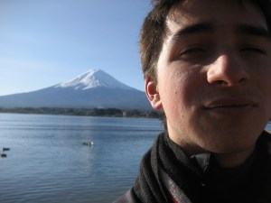
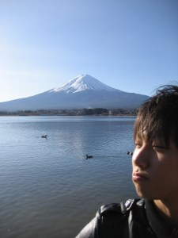

# a Period in Which Things Start to Seem Gentle and Dear

*Originally posted 2009-12-24 at <https://inpixels09.wordpress.com/2009/12/24/a-period-in-which-things-start-to-seem-gentle-and-dear/>*

In a concerned voice, they warned us that on our return home, we might get a shock like living in a foreign country. every once in a while, YFU (Youth For Understanding, the program i am on) will send out an informational packet detailing the measures you can take to lighten the load, slow the pain as you figure out its all over, and lately, the position we might find ourselves in once we get home. they say our local social scenes will have shifted and we will see more and less of different people, we may be more mature than our friends and that will be seen as arrogance, etc. to finish off the year in papers and informational sessions, they invited all the exchange students in the area, along with their families, for a re-arrival orientation in tokyo this last weekend.

on the night before we left, I stayed up until 3:30 rolling sushi with naohiro and my mother. when ryouhei woke up, came in and his face had swollen to make the shape of a sphere (apparently a nervousness-triggered non-viral version of the mumps…) we made some quick plans in our dazed, late night confusion. im sure none of us could have walked in a straight line, as this was getting near all-nighter #2 for naohiro and i, but my mother somehow managed to stumble to the phone and arrange it such that my area representative would take me and naohiro to tokyo; from there, as we had originally planned to do as a family, he would take us to a theme park at the foot of mount fuji for the day. he was surprisingly flexible for someone who works from from 9 to 10. 

lately, i have been writing a lot of speeches. in preparation for the orientation, they asked all the students to write a japanese summary of their experiences and their thanks, to present in front of everyone; in a burst of a soft ending, my school has my scheduled to make a farewell speech for 1300 people on christmas, my last day at school. I am also writing “specialized versions” of ‘thanks, its been cool’ for my class and the teachers of the school, but those are only short ones. those can be written at 330 the night before, or taken as an excerpt from one of the ones i have already written because you can only state things politely, yet creatively, within the boundaries a limited amount of times. this week, i sat in the library and talked things over with the teacher there, each time slowly approaching her office door and politely asking if she was busy; each time i either skipped the next class because we kept overflowing to new subjects or was really really fashiobably late. i try to put thought into these speeches wherever they will let me, lately my method being descriptions of very specific, special events and times rather than grand roundabout discussions. looking my time back over, searching for special things and then writing them down has really started bringing them up to the surface, and has helped me think about bringing it to an end. who knew these things made it into memories?

the secret objective of the orientation was to compare the languages skills of the kids from different countries, and shame those who didnt do their kumon worksheets. they had the eight exchange students lined up in a batting order, clearly those who were incapable went first and they had a video camera trained on the mic; all the families, too, seemed very curious as to which country had the best language skills. we americans were 3, a friend of mine from the beginning orientation (actually half japanese, so his language skills are impeccable) and a kid from minnesota. as all the kids went down the line, thai after dutch after australian, me and the half sat smug in the back and bumped fists, saying “the ball is in our court, man,” laughing at bad accents, as we were scheduled to go last. then, just before me, a good looking thai girl got up and gave a near-impromptu speech full of giggly, girly things, but our faces dropped. naohiro, who was taking a video with his ipod, kept going over our faces just to record our reactions; it was a bad speech, but like a japanese high school girl had just gotten up to have a conversation with the crowd. we felt defeated.

these mark the last of my days at the school. i have been trying to spend them carefully, not that i was ever reckless in anything, but i talk to the right people now. when all five kids sitting at my table pulled out their PSPs, i talked for the period to the one kid in the room who ive ever seen reading a novel, the quiet kid who sits in the corner. i cleaned out my desk, full of filth and english tests, and looked up to see my homeroom teacher standing there, who had written down at least 5 ways of reaching him. after business talk was over, he stayed by me and said he was going to miss me. i think he will be reading this blog. (wassup, sensei?!)

when the girls walk by in the hall, saying “herro,” and giggling when i give it back in smooth english, thats when i know im going to miss being the romantic foreigner- that kid with the accent who doesnt quite get what you are saying the first time, but keeps listening. ive taken every attempt to be spoken to by any english teacher or otherwise, knowing its the last time i might ever get a conversation beyond greetings with that guy. the girls of my class asked me to stay after school tomorrow, to go take photobooth pictures at a nearby mall. the kid who sits next to me, best student in the grade and only kid to sincerely try speaking in english, gave me a christmas card when the class gathered for a farewell karaoke party, this wednesday:  

“I am wishing you a merry christmas!”  

talking to people, its getting harder to lie that i might come back and see them, someday. 

late at night, when we have finished lifting weights in the weight room, all the club gathered in the back room and ate cake to celebrate christmas eve. we talked a little about how i felt about leaving, and i gave a round of overdone hugs to the gentlemen, saying “you will remain in my heart,” directly quoting a karaoke song and hinting at the tune. our leader is the type of kid who just picked up a carton of unopened warm milk from the corner of the room and started drinking, then looked surprised when someone asked him where it had come from; he could sit on me and kill me, but he gently handed me two pieces of chocolate before i packed up to go home and smiled. 

tomorrow is my last day at the school, christmas, and if you believe in so-called ‘time differences,’ the last few hours ill be 16, for the duration. i give a speech in the morning to the room of teachers, walk around the school taking photos with the various kid who spots me and realizes i am leaving, pack it up. im nervous as hell, sitting here and typing that this is where it all ends for me, but i tell myself there are still a few days left outside the school. 

this week, i have been staying around long after the halls go dark and only a few classroom lights remain on. ill look around my room again, re-read the posters ive seen every day, look at the staplers and chalkboards i used every day. right when you exit the shoe-less section of the school, there is a poster of a girl standing by her bike on the sunniest day, telling kids not to drink alcohol. i had a friend snap a pic of me and her, after i explained to him that she was the hottest girl in the school, and he blushed. i would have liked one of the blush, too.

I know that tomorrow marks the last day ill do so many things, like slide open the glass doors or change into the library’s brown slippers; ill be coming home with a notebook page full of email addresses, but i somehow know i wont keep in touch with more than a few close friends. for a lot of those kids, writing down their name will be a goodbye ceremony. Im going to hug some people and awkwardly shake hands with others, maybe wink at some girls and then finally ride home with my brother to celebrate christmas, maybe nothing at all, and maybe at a ramen shack nearby.  

