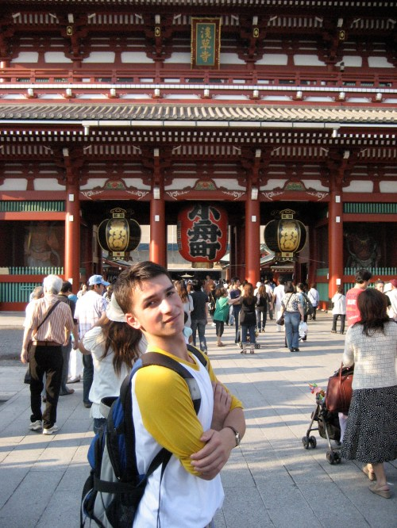
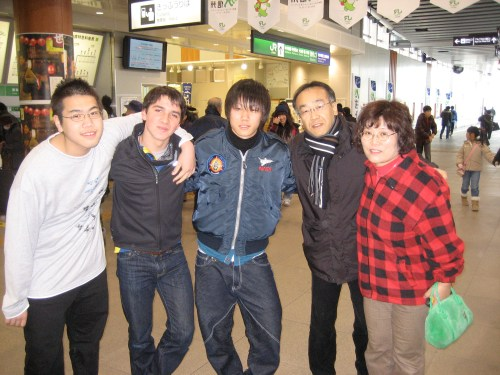

# 消滅のやり方　/ How to Disappear Completely

*Originally posted 2010-01-09 at <https://inpixels09.wordpress.com/2010/01/09/%e6%b6%88%e6%bb%85%e3%81%ae%e3%82%84%e3%82%8a%e6%96%b9%e3%80%80-how-to-disappear-completely/>*

*I* want a drug like me, dancing to j-pop in a room with blank walls, no furniture, like maybe a conversation with my mother once everyone else has gone to sleep. me and her, we talked until 3 after a night until 5 on a 3-4 hour run, where she consistently, yet absent-mindedly, hit me with the deepest, most un-answerable questions like “where does your soul reside in your body,” and, “do different people experience time in different ways?” Now, here is something to take home, i thought and laughed, walking in from walking in and out of department stores in the morning; i felt like an epicly groomed badass with longer hair, tighter jeans and my black pearl-izumi jacket zipped up tight then, but i couldnt find myself any souvenirs. that may be something ill have to forget about.

i found myself in the last two days of my 5.5 month long “exchange excursion,” as i called it in my first ever blog entry, when i woke up, the morning before shopping. I get hit with sensations in 1, 2, and 5 minute bursts like some sort of relapse, when i suddenly remember a time four months ago on a train or outside in the mountain air, and i lean forward, my heart races, stomach trembles and my head pushes me back like maybe standing in a wind tunnel; my appetite has significantly dropped and my Japanese turns worse and worse, when I am thinking about these other things. but in conversation, i can only tell people how quickly it went by, giving these quick summaries and wishing them good luck. i think its time i set down my thoughts.

Time ran short after new years, and a last act towards my best friends in a manner to suggest “yeah, this is the last time i will see you,” Naohiro broke out his cellphone and texted down our list. in a drowsy series of repeated dazed “what the f#$% !?”s, like an electric massager in a heated bath, we spent one night at a friends house, we all biked back across town to our house in the bitch of a cold evening, where another 4 came over and stayed until 2 pm the next day. now japanese parties arent as wild as anyone might have thought them to be, but the snack food is superb, energy drinks are stronger, and i had a solid sendoff with our 10 hours of card games and two trips to the bath house. the one kid who was getting on a plane to london the next day talked with me for hours about it; when i asked him why he was going, he grinned like it was funny, and said he was going to “find himself.” I happen to know he is going with his mom and i can guess that they will stay at hotels, but we were all saying wild and ambitious things to eachother, faking crying a little bit. now i am mailing back and forth with them all, telling them this isnt it because we still have email, skype, and there is still a day left if they feel the need, or when i need them, to drop back in again.

I like to think of naohiro as what an asian older brother of mine, with our relationship like this. He does looks suspiciously like a Hack… i met him in the weight room, we talked for a few hours that first night and struck up a friendship centered mainly around the bench press and those dirty english words. meanwhile, the nights i only wanted to go to sleep, listening to radiohead and chick corea came more and more frequently; i sent him a text message back when i changed hosts, and just today, i heard his story from my mother- when she had come in the door, returned from her week long trip to california, she was thanking her kids for being so understanding; naohiro said ‘dont mention it’ and held up the screen to her face.  

I most frequently talk to people when we are just two. he told me the deepest conversation he ever had was on that night after the night i had come to his house. we mustve talked about love, or maybe stephen hawking and “a brief history of time,” which i tried to lend to him, but he looked at the back cover and nodded at me, almost laughing. but i did give him every thought i had on travelling, i looked up the word for “expansion of the mind,”i told him about my experiences here and there, we got all excited.  

on living for so many days with the same person, always riding to school together in the morning, always locking his kickstand when hes not looking, too many times writing dirty, dirty words on the fogged mirrors in his favorite bath house, i got to know when he might laugh. I have explicit rights to cross his mood at any time, like snatch raamen noodles from his bowl the night he fails a test, unscathed other than a dirty look and fewer noodles that next day. naohiro told me he was in love with a girl i doubt exists and never considered what might happen if, for some reason, his plans to marry her on graduating college and move to tokyo never went through. that season came and gone when i was worried what might happen to my brother. he wants, and hell have, his own adventures.  

i think he tells only me these things, like a little brother who we both know is only here for his 2 and a half months, and will then leave. and once i leave, naohiro will listen to his ipod full-time when in the house. his ears take in less than 50% of whatever you say, on the ipod. he goes back to it when he doesnt want to reach out or be spoken to. i told him staying in touch has never been so easy.

i shouldve asked ryouhei to paint a portrait of my mother, before i leave. she could be any flavor of slightly worried, deeply sentimental, oblivious but always smiley. i wanted some way to preserve the fact that i never meet people who ask to suddenly start world travel and “healing” at the age of no one will tell me. we cant go places without her talking about traveling; apparently, its all the rage among the middle-aged nurses at her office now, suddenly deciding to travel for the first time. a woman who, through my mother, invited my irish friend me to her childrens ballroom dancing class for an evening last month (?) leaves for france in only a few weeks, with the sudden interest and sense that it couldnt wait for another holiday.  

for three days, she has started our conversations in english, english that sounds like its written down in a notebook, somewhere, because we only get in a few phrases before we get to ‘confused face,’ where we laugh and drop it. we might talk one night, and she would bring up that same thing the next at dinner, maybe more excited or eyebrow-bendingly curiously. she never watched movies seriously before, so i wrote down a list of every freaky movie i saw, i loved and woke up the next morning thinking “what!?”: so far, we have seen fight club, trainspotting, the truman show, a clockwork orange, oceans 11, slumdog millionaire, and being john malkovich is on the counter. and she loves it.  

she wants to speak english over skype, send letters and email and, also, speak japanese over skype, she told me. earlier at the table, she humbly slid across a note with her contact information on it, like i might not accept it and would just continue eating. I offered the homestay up to her as well, and she would love to come to america to see me and my culture, but for now just wants to write letters for all the talking we wont be able to continue.

I looked at my cellphone once more before i told myself i would go to bed the other night, back at my most cherished notes from the last half year, like “how come my female relationships never start with me walking in on her bathing under a waterfall?!” this last half year, i gained a sharper idea of what was before a pixelized image: in starting every relation i had, walking, training and busing the japanese landscape, in writing the character of jay in weekly periodical documents of my adventure, we now know much more than we did before.  

in significant times, there is a deep, warm pressure in my chest that pushes it up and forwards, makes it feel filled with warm liquid. on being inspired, hearing or seeing something i previously couldnt comprehend, it kicks in and my head goes light, stomach quivers and i can only imagine myself in so many angles with some new dimension, some previously unthought of dimension. I had this when i was younger, quite a bit, when anything would do it like a night at summer camp or a circue di soliel video tape and stayed up all night thinking of my future break dancing. it took me a while to feel it, but now i feel that pressure like nothing when i stopped to think and write, and im shaking and blushing while typing.  

I had the most significant day in my life in week long spurts, since maybe when I got off the plane. I was mystified, repelled and confused at the things Japanese people construct their environment from, still feel sick sometimes, but then again, the thought that a 17 year old could comprehend everything would be disappointing. I think i have found myself at the summit of these 17 years; now, however, things have opened up and ive seen new dimensions and angles on who we are as people, and what we can make of it. My adventure ends here, but its hard not to look forward to the rest of my life, in the widening and diverse world that my experience in japan has introduced me to. I know I am going to be rolling off quotes and lessons from japan as long as anyone will listen.  

And I have new friends, new people who have touched my life and I have played a role in so many others, knowing me exclusively for the fact that I came here and did these things. When I leave, its going to take years and years for the presence of eathother to fade, im thinking tonight. This is going to stay with me, hopefully with my friends and family, until we are beaten and aged, and the memory of jay hack disappears completely.

*     *     *

this marks the end of ‘in pixels,’ as i get on a train to tokyo in just under 7 hours. I would love to keep going at it week after week, but it is time for me to go home. i saw an article on comcast news the other day on massive winter storms hitting the midwest; facebook is plastered with people referring to their chemistry homework, winter dance, etc., and i looking forward to revelling in it all over. I will be a second-semester junior at my same highschool, but am entirely unsure about how the new (old?) environment will feel in comparison, what will have changed, and where i will be when things settle down. another adventure? eh?  

this is going to be a great personal record of my thoughts and feelings while in the midst of my half-year exchange. I plan to keep it up on the internet for at least a little while, so feel free to stop back by. I hope you have enjoyed reading what i had to say, and thank you for your attention, comments, for providing me with this justifiable thought-log, and sending the love back out here. I am back in the states near midnight on the 10th, so drop me a line.  

thanks, enjoy that weather-

-Jay

